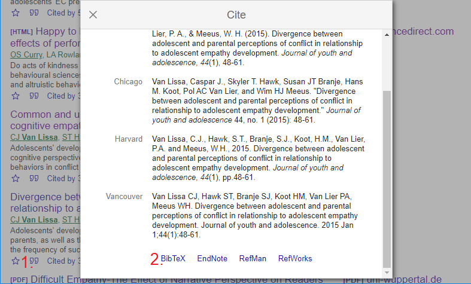

# Citing references in worcs

Comprehensive citation of literature, data, materials, methods, and
software is one of the hallmarks of open science. When using the
R-implementation of WORCS, you will most likely be writing your
manuscript in `RMarkdown` format. This means that you will use Markdown
`citekey`s to refer to references, and these references will be stored
in a separate text file known as a `.bib` file.

To ease this process, we recommend following this procedure for
citation:

1.  During writing, maintain a plain-text `.bib` file with the BibTeX
    references for all citations.
    - You can export a `.bib` file from most reference manager programs;
      the free, open-source reference manager
      [Zotero](https://www.zotero.org/download/) is excellent and
      user-friendly, and highly interoperable with other commercial
      reference managers. Searching for “How to Integrate Zotero
      Citations with R Markdown” will yield tutorials for using Zotero
      with RMarkdown.
    - Alternatively, it is possible to make this file by hand, copy and
      pasting each new reference below the previous one; e.g., Figure
      @ref(fig:scholarbib) shows how to obtain a BibTeX reference from
      Google Scholar; simply copy-paste each reference into the `.bib`
      file
2.  To cite a reference, use the `citekey` - the first word in the
    BibTeX entry for that reference. Insert it in the RMarkdown file
    like so: `@yourcitekey2020`. For a parenthesized reference, use
    `[@citekeyone2020; @citekeytwo2020]`. For more options, see the
    [RMarkdown
    cookbook](https://bookdown.org/yihui/rmarkdown-cookbook/bibliography.html).
3.  To indicate a *non-essential* citation, mark it with a double
    at-symbol: `@@nonessential2020`.
4.  When Knitting the document, adapt the `knit` command in the YAML
    header.  
    `knit: worcs::cite_all` renders all citations, and  
    `knit: worcs::cite_essential` removes all *non-essential* citations.
5.  Optional: To be extremely thorough, you could make a “branch” of the
    GitHub repository for the print version of the manuscript. Only in
    this branch, you use the function `knit: worcs::cite_essential`. The
    procedure is documented in [this
    tutorial](http://rstudio-pubs-static.s3.amazonaws.com/142364_3b344a38149b465c8ebc9a8cd2eee3aa.md).

Exporting a BibTex reference from Google Scholar
