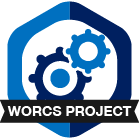

# Readme 

<!-- Please add a brief introduction to explain what the project is about    -->

## Where do I start?

You can load this project in RStudio by opening the file called 

## Project structure

<!--  You can add rows to this table, using "|" to separate columns.         -->

<!--  You can consider adding the following to this file:                    -->
<!--  * A citation reference for your project                                -->
<!--  * Contact information for questions/comments                           -->
<!--  * How people can offer to contribute to the project                    -->
<!--  * A contributor code of conduct, https://www.contributor-covenant.org/ -->

# Reproducibility

This project uses the Workflow for Open Reproducible Code in Science (WORCS) to
ensure transparency and reproducibility. The workflow is designed to meet the
principles of Open Science throughout a research project. 

* To learn how WORCS helps researchers meet the TOP-guidelines and FAIR principles, read the preprint at https://osf.io/zcvbs/
* To get started with `worcs`, see the [setup vignette](https://cjvanlissa.github.io/worcs/articles/setup.html)
* For detailed information about the steps of the WORCS workflow, see the [workflow vignette](https://cjvanlissa.github.io/worcs/articles/workflow.html)
* For a brief overview of the steps of the WORCS workflow, see below.

## WORCS: Steps to follow for a project

## Phase 1: Study design

1. Create a (Public or Private) remote repository on a 'Git' hosting service
2. When using R, initialize a new RStudio project using the WORCS template. Otherwise, clone the remote repository to your local project folder.
3. Add a README.md file, explaining how users should interact with the project, and a LICENSE to explain users' rights and limit your liability. The `worcs` project template does this automatically.
3. Optional: Preregister your analysis by committing a plain-text preregistration and tagging the commit as "preregistration".
4. Optional: Upload the preregistration to a dedicated preregistration server
5. Optional: Add study Materials to the repository

## Phase 2: Writing and analysis

6. Create an executable script documenting the code required to load the raw data into a tabular format, and de-identify human subjects if applicable
7. Save the data into a plain-text tabular format like `.csv`. When using open data, commit this file to 'Git'. When using closed data, commit a checksum of the file, and a synthetic copy of the data.
8. Write the manuscript using a dynamic document generation format, with code chunks to perform the analyses.
9. Commit every small change to the 'Git' repository
10. Cite essential references with `@`, and non-essential references with `@@`

## Phase 3: Submission and publication

11. Use dependency management to make the computational environment fully reproducible
12. Optional: Add a WORCS-badge to your project's README file
13. Make a Private 'Git' remote repository Public
14. Optional: [Create a project page on the Open Science Framework](https://help.osf.io/hc/en-us/articles/360019737594-Create-a-Project)
15. [Connect your 'OSF' project page to the 'Git' remote repository](https://help.osf.io/hc/en-us/articles/360019929813-Connect-GitHub-to-a-Project)
16. Add an open science statement to the Abstract or Author notes, which links to the 'Git' remote repository or 'OSF' page
17. Render the dynamic document to PDF
18. Optional: [Publish the PDF as a preprint, and add it to the OSF project](https://help.osf.io/hc/en-us/articles/360019930533-Upload-a-Preprint)
19. Submit the paper, and tag the release of the submitted paper, as in Step 3.

## Notes for cautious researchers

Some researchers might want to share their work only once the paper is accepted for publication. In this case, we recommend creating a "Private" repository in Step 1, and completing Steps 13-18 upon acceptance.
