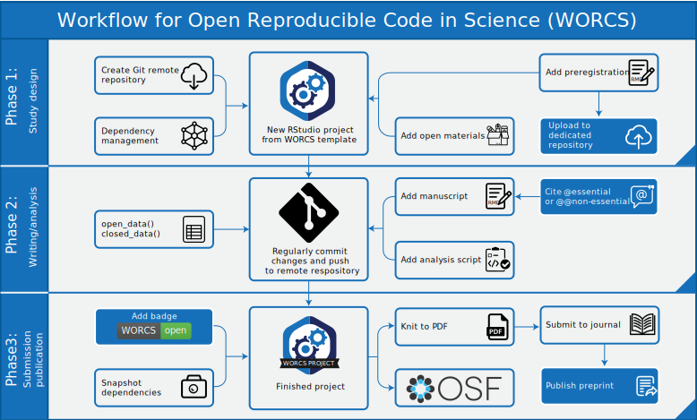

true
================
true

Academia is arguably past the tipping point of a paradigm shift towards
open science. Several immediate causes rallied support for this
transition, including highly publicized cases of scientific fraud (as
discussed by Levelt, Noort, and Drenth 2012), increasing awareness of
questionable research practices and their consequences for the
credibility of findings (John, Loewenstein, and Prelec 2012), and the
replication crisis (Shrout and Rodgers 2018). However, open science
should not be seen as a cure (or punishment) for this crisis. As the
late dr. Jonathan Tennant put it: “Open science is just good science”
(Tennant 2018). Open science creates opportunities for researchers to
more easily conduct reliable, cumulative, and collaborative science
(Nosek and Bar-Anan 2012; Adolph et al. 2012). Open science also
promotes inclusivity, because it removes barriers for participation.
Capitalizing on these advances has the potential to accelerate
scientific progress (see also Coyne 2016).

Many researchers are motivated to adopt current best practices for open
science and enjoy these benefits. And yet, the question of “how” to
apply open science practices can be daunting. Making the transition
requires researchers to become knowledgeable about different open
science challenges and solutions, and to become proficient with new and
unfamiliar tools. This paper is designed to ease that transition by
presenting a simple workflow that meets most requirements open science,
and is based on best practices: The *Workflow for Open Reproducible Code
in Science* (WORCS). WORCS is a lightweight approach to open science and
computational reproducibility for scholars working in  on a private
computer, conducting research that involves academic prose, analysis
code, and (optionally) tabular data - but it is flexible enough to
accommodate many other scenarios. The workflow (Figure
@ref(fig:workflow)) constitutes a step-by-step procedure that
researchers can follow to make a research project (including data, code,
and a report) open and reproducible. WORCS is compatible with open
science requirements already implemented by journals and institutions,
and will help fulfill them. It can also be used in the absence of
top-down support or guidelines to produce work in accordance with best
practices. Although the principles underlying this workflow are
universal, WORCS has first been implemented for  users (R Core Team
2020). The  package  (Van Lissa, Peikert, and Brandmaier 2020) offers a
project template for RStudio (RStudio Team 2015), which is, effectively,
a “one click solution”. This paper introduces the WORCS workflow,
discusses how it meets best practices for open science, and illustrates
the use of the  package.

Schematic illustration of the WORCS procedure.

# Defining Open Science practices

Although Open Science is advocated by many, it does not have a unitary
definition (for an effort to ground open science in first principles,
see Tennant 2020). Instead, several guidelines exist for practices that
are considered “open”. The TOP-guidelines are one of the most
influential operationalisations of Open Science principles (Nosek et al.
2015). These guidelines describe eight standards for open science: 1)
Comprehensive citation of literature, data, materials, and methods; 2)
sharing data, 3) sharing the code required to reproduce analyses, 4)
sharing new research materials, and 5) sharing details of the design and
analysis; 6) pre-registration of studies before data collection, and 7)
pre-registration of the analysis plan prior to analysis; and 8)
replication of published results. WORCS defines the goals of open
science in terms of these guidelines, and is designed to facilitate
meeting each of these guidelines, with one exception: We do not address
replication of published results, because replication relates to the
subject of a research project, not to its organization or execution. We
group the remaining seven guidelines into three categories: citation
(1), sharing (2-5), and preregistration (6-7).

## Introducing the tools

WORCS relies on several free, open source software solutions which we
will discuss before introducing the workflow.

### Dynamic document generation

The first is *dynamic document generation* (DDG): Writing scientific
reports in a format that interleaves written reports with blocks of code
used to conduct the analyses. The text is automatically formatted as a
scientific paper in several potential styles. When the text is
formatted, the code blocks are evaluated and their results are insterted
in the text, or rendered as figures and tables. Dynamic document
generation supersedes the classical approach of using separate programs
to write prose and conduct analyses, and then manually copy-pasting
analysis results into the text. The source code of this paper can serve
as an example of DDG, and is [available
here](https://github.com/cjvanlissa/worcs/blob/master/paper/Manuscript.Rmd).

Although there is a slight learning curve to transitioning to DDG, we
strongly believe that the investment will pay off for users of the
workflow, as it did for us. Time saved from painstakingly copy-pasting
output and manually formatting text soon outweighs the investment of
switching to a new program. Moreover, human error in manually copying
results is eliminated. When revisions require major changes to the
analyses, all results, figures and tables can be automatically updated.
The flexibility in output formats also means that a manuscript can be
rendered to presentation format, or even to a website or blog post.
Moreover, the fact that code can be run each time the document is
compiled encourages researchers to work reproducibly, and allows
reviewers and/or readers verify reproducibility simply by re-compiling
the document. In sum, while writing academic papers in a programming
environment might seem counter-intuitive at first, this approach is much
more amenable to the needs of academics than most word processing
software. It prevents mistakes, and saves time.

In the  implementation of WORCS, we recommend centering a research
project around one dynamically generated  document, which includes all
analysis code. Longer scripts can be stored in  files, and called from
the main document using the  function. When a reader or reviewer
compiles this document, all code is run automatically, thus verifying
computational replicability. The  document can be automatically
formatted in many styles, including APA style (thanks to the  package ,
Aust and Barth 2020), a host of other scientific formats (see J. Allaire
et al. 2020), and as plain .

### Version control

The second solution is *version control*: Maintaining an indelible log
of every change to all project files. Version control is a
near-essential tool for scientific reproducibility, as anyone learns who
has had the experience of accidentally deleting a crucial file, or of
being unable to reproduce analyses because they ran some analyses
interactively, instead of documenting the syntax in a script file (see
also Blischak, Davenport, and Wilson 2016). Many scientists use some
form of *implicit* version control; for example, by renaming files after
major changes (e.g., “manuscript\_final\_2.2-2019-10-12.doc”), tracking
changes in word processing software, or using cloud hosting services
that retain backups of previous versions.

An integral part of WORCS is the *explicit* version control software Git
(www.git-scm.com). Git tracks changes to files, and stores these changes
when the user makes a “commit” (a snapshot of the version controlled
files). Git retains a complete log of all commits, and users can compare
changes between different commits, or go back to a previous version of
the code (for example, after making a mistake, or to replicate a
previous version of the results). A project version controlled with Git
is called a “Repository”, or Repo. Git only version controls files
explicitly committed by the user. Moreover, it is possible to prevent
files from being version controlled - which is useful for privacy
sensitive data. A  file lists files that should not be
version-controlled. These files thus exist only on the user’s private
computer.

The functionality of Git is amplified by services such as GitHub
(<https://github.com>). GitHub is best understood as a cloud storage
service with social networking functionality. The cloud storage aspect
of GitHub works as follows: You can “clone” (copy) a local Git
repository to the GitHub website, as a backup or research archive. The
social network aspect comes into play when a repository on GitHub is set
to “public”: This allows other researchers to peruse the repository and
see how the work was done; clone it to their own computer to replicate
the original work or apply the methods to their own data; open “Issues”
to ask questions or give feedback on the project, or even send a “Pull
request” with suggested changes to the text or code for your
consideration. Git and GitHub shine as tools for collaboration, because
different people can simultaneously work on different parts of a
project, and their changes can be compared and automatically merged on
the website. Even on solo projects, working with Git/GitHub has many
benefits: Staying organized, being able to start a new study with a
clone of an old, similar repository, or splitting off an “experimental
branch” to try something new, while retaining the ability to “revert”
(return) to a previous state of the project, or to “merge” (incorporate)
the experimental branch.

It is worth noting that, although this paper focuses on the most widely
used Git remote repository service, GitHub, two notable alternatives
exist: GitLab (<https://gitlab.com>) and Bitbucket
(<https://bitbucket.org>). In order to present the workflow in a
platform-agnostic way, we will refer to such cloud hosting services as
“remote repositories” in the remainder of this paper. As of version
0.1.2,  has been tested with these three remote repository services, but
has been optimized for use with GitHub. A
[vignette](https://cjvanlissa.github.io/worcs/articles/git_cloud.html)
is included with instructions for using alternative platforms. When
initializing a new project using the  project template, a ‘https’ remote
repository address will usually work best with the authentication
procedure outlined in the [setup
vignette](https://cjvanlissa.github.io/worcs/articles/setup.html).

The  implementation of WORCS uses the package , a Git client for  (Ooms
2019), to connect a local project to a remote repository. The  package
also contains a user-friendly function to set the default user
credentials, , and a function to add, commit, and push all changed files
to a remote repository in one step, .

### Dependency management

The third solution is *dependency management*: Keeping track of exactly
what software was used to conduct the analyses. At first glance, it
might seem sufficient to state that analyses were conducted in *Program
X*. However, every program is susceptible to changes, updates, and
bugfixes. A lot of Open Source software, in particular, is regularly
updated because there is an active community of developers contributing
functionality and bugfixes. Potentially, any such update could change
the results of the code, thus rendering the analysis computationally
non-reproducible.

Many solutions exist to ensure computational reproducibility. These
solutions typically work by enveloping your research project in a
distinct “environment” that only has access to programs that are
explicitly installed, and maintaining a record of these programs. These
solutions differ in user-friendliness and effectiveness. If strict
reproducibility is required, users might choose to conduct all analyses
in a “Docker container”: An environment that behaves like a virtual
computer, which can be stored like a sort of time capsule, and
identically reinstated on a user computer, or in the cloud. This is
effective, and also preserves software outside the  environment (e.g.,
preprocessing tools for neuroimaging data). A Docker-based workflow was
recently introduced by Peikert and Brandmaier (2019). This workflow is
based on many of the same principles as WORCS, and the two approaches
are conceptually and practically compatible. However, the workflow
described by Peikert and Brandmaier can be difficult to set up for
novice users. The accompanying  package  is currently in development to
facilitate this transition (Peikert, Brandmaier, and Van Lissa 2020).
Another user-friendly Docker-based workflow is offered by the
cloud-based collaboration platform ‘Code Ocean’. Although Code Ocean
enjoys some popularity among scientists, it is not clear whether this
platform is GDPR compliant - as of this writing, its [terms of
use](https://codeocean.com/terms-of-use) do not address the GDPR, nor is
it clear where data are stored. The necessity to upload data for
analysis is a risk with any cloud-computing solution when human
participants are involved.

For analyses conducted entirely in , the recently released package 
strikes a great balance between user-friendliness and effectiveness.
Developed by the team behind RStudio, this package simply maintains a
text-based, human-readable log of all packages used, their version
numbers, and where they were installed from (e.g., CRAN, Bioconductor,
GitHub). As long as these repositories maintain their archives, this
solution is reliable and very lightweight. The text-based log file can
be version controlled with Git.  installs the logged packages in a cache
that is shared between all projects on the computer. Thus, if one of
your projects uses a package that is already in the cache, it does not
need to be installed again. This prevents long installation times, large
space requirements, and frustration having to re-install software that
is already installed on the system. When someone else loads your
project,  will install all of the required packages onto a cache on
their computer. This is not a foolproof method to ensure strict
computational reproducibility, but it is more user-friendly and
lightweight than any alternative out there, requiring no technical skill
to setup. When choosing an appropriate solution for dependency
management, it is important to consider that all solutions have a
limited shelf life (Brown 2017). Ultimately, the best approach might be
to use a “just good-enough” solution, and acknowledge that all code
requires some maintenance if you want to reproduce it in the future. For
projects in ,  meets these requirements.

## Text-based files are better

A key consideration when developing a research project is what filetypes
to use. A case can be made to use text-based files exclusively (or as
much as possible), instead of binary files. Text-based files can be read
by machines and humans alike. Binary files, such as Word () or SPSS (, )
files, must be decoded first, and many require commercial software to do
so. The version control software Git is also designed for use with
text-based files. The Git change log reflects changes to text-based
files on a line-by-line basis. Binary files can be version controlled
with Git, but the change log for a binary file are uninterpretable.
Binary files are also often larger than text-based files, which means
they take up more space on cloud hosting services. For these reasons,
uploading large binary files to remote repositories is frowned upon.
WORCS encourages the use of text-based files for all purposes.

Two additional points are worth noting: First, Git tracks line-by-line
changes to text-based files, based on line breaks in the text. When
writing a version-controlled paper in plain-text, it is therefore
recommended to start each sentence on a new line. That way, the change
log will indicate which specific sentence was edited, instead of
replacing an entire paragraph. As RMarkdown does not parse a single line
break as the end of a paragraph, this practice does not disrupt the flow
of a paragraph in the rendered version. Second, the remote repository
service GitHub rewards the use of text-based files by rendering certain
text-based filetypes for online viewing: For example,  (Markdown) files
are displayed as web pages, and  files as spreadsheets. The 
implementation for  makes use of this fact by, for example, rendering a
codebook for the data as  so visitors of a Git remote repository can
view it as a web page.

# Introducing the workflow

We provide a conceptual outline of the WORCS procedure below, based on
WORCS Version 0.1.2. For users of the   package, we highly recommend
referring to [the workflow
vignette](https://cjvanlissa.github.io/worcs/articles/setup.html), which
is more detailed and updated with future developments.

## Phase 1: Study design

1.  Create a (Public or Private) remote repository on a ‘Git’ hosting
    service
2.  When using R, initialize a new RStudio project using the WORCS
    template. Otherwise, clone the remote repository to your local
    project folder.
3.  Add a README.md file, explaining how users should interact with the
    project, and a LICENSE to explain users’ rights and limit your
    liability. The `worcs` project template does this automatically.
4.  Optional: Preregister your analysis by committing a plain-text
    preregistration and tagging the commit as “preregistration”.
5.  Optional: Upload the preregistration to a dedicated preregistration
    server
6.  Optional: Add study Materials to the repository

## Phase 2: Writing and analysis

6.  Create an executable script documenting the code required to load
    the raw data into a tabular format, and de-identify human subjects
    if applicable
7.  Save the data into a plain-text tabular format like `.csv`. When
    using open data, commit this file to ‘Git’. When using closed data,
    commit a checksum of the file, and a synthetic copy of the data.
8.  Write the manuscript using a dynamic document generation format,
    with code chunks to perform the analyses.
9.  Commit every small change to the ‘Git’ repository
10. Cite essential references with `@`, and non-essential references
    with `@@`

## Phase 3: Submission and publication

11. Use dependency management to make the computational environment
    fully reproducible
12. Optional: Add a WORCS-badge to your project’s README file
13. Make a Private ‘Git’ remote repository Public
14. Optional: [Create a project page on the Open Science
    Framework](https://help.osf.io/hc/en-us/articles/360019737594-Create-a-Project)
15. [Connect your ‘OSF’ project page to the ‘Git’ remote
    repository](https://help.osf.io/hc/en-us/articles/360019929813-Connect-GitHub-to-a-Project)
16. Add an open science statement to the Abstract or Author notes, which
    links to the ‘Git’ remote repository or ‘OSF’ page
17. Render the dynamic document to PDF
18. Optional: [Publish the PDF as a preprint, and add it to the OSF
    project](https://help.osf.io/hc/en-us/articles/360019930533-Upload-a-Preprint)
19. Submit the paper, and tag the release of the submitted paper, as in
    Step 3.

## Notes for cautious researchers

Some researchers might want to share their work only once the paper is
accepted for publication. In this case, we recommend creating a
“Private” repository in Step 1, and completing Steps 13-18 upon
acceptance.

## The R implementation of WORCS

The  package  automates most steps of the workflow for  users. Several
arguments support the choice to implement this workflow in . First,  and
all of it extensions are free open source software, which make it a tool
of choice for open science. Second, all tools required for an open
science workflow are implemented in , most of these tools are directly
accessible through the user interface of RStudio, and some of them are
actively developed by the team behind RStudio. Third,  is the
second-most cited statistical software package (Muenchen 2012),
following SPSS, which has no support for any of the open science tools
discussed in this paper. Fourth,  is well-supported; a vibrant and
inclusive online community exists for , developing new  methods and
packages, and providing support and tutorials for existing ones.
Finally,  is highly interoperable: Packages are available to load nearly
every imaginable filetype, and output can be written to most file types,
including DOCX and PDF (in APA style), and HTML format. Moreover,
wrappers are available for many tools developed in other programming
languages, and code written in other programming languages can be
evaluated from , including , , and  (J. J. Allaire et al. 2020). There
are excellent free resources for learning  (e.g., Grolemund and Wickham
2017).

Working with  is simplified immensely by using the RStudio integrated
development engine (IDE) for  (RStudio Team 2015). RStudio automates and
streamlines tedious or complicated aspects of working with the tools
used in WORCS, and many are embedded directly into the visual user
interface. This makes RStudio a comprehensive solution for open science
research projects. Another important feature of RStudio is project
management. A project bundles writing, analyses, data, references, et
cetera, into a self-contained folder, that can be uploaded entirely to a
Git remote repository and downloaded by future users. The   package
installs a new RStudio project template. When a new project is
initialized from this template, the bookkeeping required to set up an
open science project is performed automatically.

### Preparing your system

Before you can use the  implementation of the WORCS workflow, you have
to install the required software. You only have to perform this setup
procedure only once for each computer you intend to use  on. It should
take about 30 minutes, and it is documented in [the setup
vignette](https://cjvanlissa.github.io/worcs/articles/setup.html). The
setup vignette does not assume a prior installation of , so it is
suitable for novice users. After setting up your system, you can use 
for all of your projects. The  implementation of the workflow introduced
earlier is detailed, step-by-step, in [the workflow
vignette](https://cjvanlissa.github.io/worcs/articles/workflow.html).

# How WORCS helps meet the TOP-guidelines

## Comprehensive citation

The TOP-guidelines encourage comprehensive citation of literature, data,
materials, methods, and software. In principle, researchers can meet
this requirement by simply citing every reference used. Unfortunately,
citation of data and software is less commonplace than citation of
literature and materials. Crediting these resources is important,
because it incentivizes data sharing and the development of open-source
software, supports the open science efforts of others, and helps
researchers receive credit for *all* of their research output, in line
with the San Francisco Declaration on Research Assessment,
[DORA](https://sfdora.org/).

To facilitate citing datasets, researchers sometimes publish *data
papers*; documents that detail the procedure, sample, and codebook.
Specialized journals, such as the [*Journal of Open Psychology
Data*](https://openpsychologydata.metajnl.com/), aid in the publication
of these data papers. For smaller projects, researchers often simply
share the data in a remote repository, along with a text file with the
preferred citation for the data (which can be a substantive paper), and
the license that applies to the data, such as Creative Commons
[BY-SA](https://creativecommons.org/licenses/by-sa/4.0/) or
[BY-NC-SA](https://creativecommons.org/licenses/by-nc-sa/4.0/). When in
doubt, one can always contact the data creators and ask what the
preferred citation is.

References for software are sometimes provided within the software
environment; for example, in , package references can be found by
calling . This returns an APA-style reference, and a BibTeX entry.
Software papers are also common, and are sometimes called “Application
Notes”. The [Journal of Open Source Software
(JOSS)](https://joss.theoj.org/) offers programmers a way to generate a
publication based on well-documented software; in this process, the code
itself is peer reviewed, and writing an actual paper is optional. For an
example, see Rosenberg et al. (2018). Software citations can also
sometimes be found in the source code repository (e.g., on Git remote
repositories), using the [‘Citation File
Format’](https://citation-file-format.github.io/). The [*Software
Heritage
Project*](https://www.softwareheritage.org/2020/05/26/citing-software-with-style/)
recently published a BibLaTeX software citation style that will further
facilitate accurate citation of software in dynamically generated
documents.

One important impediment to comprehensive citation is the fact that
print journals operate with space constraints. Print journals often
discourage comprehensive citation, either actively, or passively by
including the reference list in the manuscript word count. Researchers
can overcome this impediment by preparing two versions of the
manuscript: One version with comprehensive citations for online
dissemination, and another version for print, with only the essential
citations. The print version should reference the online version, so
interested readers can find the comprehensive reference list. The WORCS
procedure suggests uploading the online version to a preprint server.
This is important because most major preprint servers - including
[arXiv.org](https://arxiv.org) and all preprint services hosted by the
[Open Science Framework
(OSF)](https://help.osf.io/hc/en-us/articles/360019930493-Preprint-FAQs#how_do_i_find_preprints)
- are indexed by Google Scholar. This means that authors will receive
credit for cited work; even if they are cited only in the online
version. Moreover, preprint servers ensure that the online version will
have a persistent DOI, and will remain reliably accessible, just like
the print version.

## Implementation in worcs

The  package includes a [vignette on
citation](https://cjvanlissa.github.io/worcs/articles/citing.html) to
explain the fundamentals for novice users, and offer recommendations
specific to . We recommend using the free, open-source reference manager
[Zotero](https://www.zotero.org/download/); it is feature-rich,
user-friendly, and highly interoperable with other reference managers. A
tutorial for using Zotero with RMarkdown exists
[here](https://christopherjunk.netlify.com/blog/2019/02/25/zotero-RMarkdown/).

The  package also offers original solutions for comprehensive citation.
Firstly, during the writing process, authors can mark the distinction
between essential and non-essential references. It is easier to do this
from the start, instead of going back to cut non-essential references
just prior to publication. Standard Markdown uses the at-symbol () to
cite a reference.  additionally reserves the “double at”-symbol () to
cite a non-essential reference. Users can render the manuscript either
with, or without, comprehensive citations by adapting the  command in
the front matter, setting it to  to render all citations, and to  to
remove all *non-essential* citations.

With regard to the citation of  packages, it is worth noting that the 
package (Aust and Barth 2020), which provides the  template used in ,
also includes functions to automatically cite all packages used in the 
session, and add their references to the bibliography file.

## Data sharing

Data sharing is important for computational reproducibility and
secondary analysis. Computational reproducibility means that a third
party can exactly recreate the results from the original data, using the
published analysis code. Secondary analysis means that a third party can
conduct sensitivity analyses, explore alternative explanations, or even
use existing data to answer a different research question. From an open
science perspective, data sharing is always desirable. From a practical
point of view, it is not always possible. Data sharing may be impeded by
lack of storage space, legal constraints, ethical restrictions, absence
of informed consent for data sharing, or privacy concerns. For example,
one concern that applies when working with human participant data, is
pseudonimization. Many legislatures require researchers to ‘de-identify’
human subject data upon collection, by removing or deleting any
sensitive personal information and contact details. However, when
researchers have an imperfect understanding of the legal obligations and
dispensations, they can end up over- or undersharing, and risk either
placing participants at risk of being identified, or undermine the
replicability of their own work and potential reuse value of their data
(Phillips and Knoppers 2016).

Once data are de-identified or pseudononimized, they can often be shared
if participants have provided informed consent to that effect.
Nevertheles, it is important to note that the European GDPR prohibits
storing ‘personal data’ (information which can identify a natural person
whether directly or indirectly) on a server outside the EU, unless it
offers an “adequate level of protection”. Although different rules may
apply to pseudonimized data, there are many repositories that are GDPR
compliant, such as the European servers of the Open Science Framework.
Different Universities, countries, and funding bodies also have their
own repositories that are complient with local legistation. Before
sharing any human participant data, it is recommended to obtain approval
from an internal (ethical) review board, guidance from Research Data
Management Support, and informed consent from participants.

If data can be shared openly, they can simply be pushed to a public Git
repository, along with the analysis code. This way, others can download
the entire repository and reproduce the analyses from start to finish.
If data cannot be shared, researchers should aim to safeguard the
potential for computational reproducibility and secondary analysis as
much as possible. WORCS recommends two solutions to accomplish this
goal. The first solution is to publish a *checksum* of the original data
file (Rivest 1992). Think of a checksum as a 32-character summary, or as
a “one word” description, of the contents of a file. Any change to the
file will result in a different checksum\[1\]. Thus, one can use a
checksum to verify the identity of a file, and ensure that its contents
are unchanged. When data cannot be shared, the risk of fraud or abuse
can be mitigated by publishing a checksum for the original data, in
addition to the complete analysis code. Using the checksum to verify the
identity of a private dataset, researchers can prove to an independent
auditor that running the public analysis code on the private data
results in the published results of their work.

The second solution is to share a synthetic dataset with similar
characteristics to the real data. Synthetic data mimic the level of
measurement and (conditional) distributions of the real data (see Nowok,
Raab, and Dibben 2016). Sharing synthetic data allows any third party to
1) verify that the published code works, 2) debug the code, and 3) write
valid code for alternative analyses. It is important to note that
complex multivariate relationships present in the real data are often
lost in synthetic data. Thus, findings from the real data might not be
replicated in the synthetic data, and findings in the synthetic data
*should not be substantively interpreted*. Still, sharing synthetic data
facilitates data requests from third parties. A third party can write
analysis code based on the synthetic data, and send it to the authors
who evaluate it on the real data and send back the results. The  package
offers a simple but flexible function to generate synthetic data, ,
which by default uses random forests to generate a model for synthesis
(see Wright and Ziegler (2015)). For data synthesis to work properly, it
is essential that the  (data type) of variables is defined correctly. As
of  version , numeric, integer, factor, and logical data are supported
out of the box. Other types of variables should be converted to one of
these types, or users can use a custom  when calling .

### Processing data in WORCS

When initializing a new  project, an empty  script called  is generated.
As soon as raw data are collected, researchers should use this file to
document all steps necessary to load the data into , pseudonimize it,
and prepare it for analysis. As data should be shared in a format as
close to raw as possible, this script should be as short as possible and
only document the minimum necessary steps. For example, if the data was
originally in SPSS format with IP addresses and GPS location, this file
might just contain the code required to read the SPSS file, and to
remove those columns of sensitive personal information. As soon as the
data are pseudonimized and processed into tabular (spreadsheet-like)
format, the researcher should version control some indelible record of
the raw data. The concept of ‘tidy’ data is a helpful standard; i.e.,
clean, tabular data that is formatted in a way that facilitates further
analysis (see Wickham 2014).

One issue of concern is the practice of “fixing” mistakes in the data.
It is not uncommon for researchers to perform such corrections manually
in the raw data, even if all other analysis steps are documented.
Regardless of whether the data will be open or closed, it is important
that the raw data be left unchanged as much as possible. This eliminates
human error. Any alterations to the data - including processing steps
and even error corrections - should be documented in the code, instead
of applied to the raw data. This way, the code will be a pipeline from
the raw data to the published results. Thus, for instance, if data have
been entered manually in a spreadsheet, and a researcher discovers that
in one of the variables, missing values were coded as  whereas they were
coded as  in all other variables, then we would recommend adding a line
of code to recode the missing values - thereby documenting the mistake -
instead of “fixing” it by editing the raw spreadsheet.

The  package offers two functions for version controlling a record of
the data: One for open, and one for closed data. Researchers should
assume that the decision to make data open is irreversible. Thus, the
decision should be made well before arriving at this stage in the
workflow. If there is any doubt, it is prudent to proceed with closed
data and make the data open once all doubt is assuaged.

In , researchers can call the function  to make the data publicly
available. This function stores the  object (such as a  or ) in a
tabular data file (called  by default). It also generates an
accompanying codebook - a human-readable document that serves as a
legend for the tabular data file - that can be viewed online. All
changed files should now be added to the Git repository, committed, and
pushed to the remote repository. This can be done through the Git panel
in RStudio, or by running the  function . Once the remote repository is
made public, these data will be open to the public. Assume that, once
this is done, the data cannot be un-shared.

Alternatively, if the project requires data to remain closed,
researchers can call . This function also stores the data in a local 
file and generates a codebook, but the original data file is added to 
so it cannot be accidentally added to the Git repository. The function
also computes a checksum for the original data, and logs it in the 
project file. This checksum serves as the indelible record of the state
of the raw data. The function  also creates a synthetic dataset (called 
by default). The user should push all changed files to the remote
repository. Once the remote repository is made public, people will have
access to a checksum for the original data that exist on your local
machine, a codebook describing those data, and a synthetic copy of the
data. Keep in mind that, when using closed data, the original data file
exists only on the user’s computer. Adequate provisions to back up the
data, while respecting principles of responsible data stewardship,
should be made.

As the purpose of the  file is to prepare data for sharing, the final
line of this file should typically be either  or .

After generating tidy, shareable data, this data is then loaded in the
analysis code with the function . This function only loads the real data
if it is available on the user’s computer, and otherwise, loads the
synthetic data. This will have the effect that third party users who
copy a remote repository with closed data will automatically load the
synthetic dataset, whereas the study authors, who have the real data
stored locally, will automatically load the real data. This makes it
possible for reviewers, coauthors, and auditors, to write analysis
scripts without requiring access to the original data. They can simply
start the script with , and write their code based on the synthetic
data. Then, they can submit their code to you - by email or as a [“Pull
request”](https://help.github.com/en/github/collaborating-with-issues-and-pull-requests/creating-a-pull-request).
When you run their code on your system,  will load the original data,
and use that to run their script. You can then return the results to the
third party.

Note that these functions can be used to store multiple data files, if
necessary. As of version 0.1.2, the  package only stores data as  files.
As explained above, this is recommended, because  files are human- and
machine readable, and because data typically need to be in tabular
format for analysis. Many types of data can be represented as a table;
for example, text corpora can have one row per document, and EEG- or ECG
waveforms can have a row per measurement occasion and a column per
channel. The  file should document any steps required to convert these
data into tabular format. If this is not an appropriate format for the
data, readers are encouraged to follow the development of the  package
(Peikert, Brandmaier, and Van Lissa 2020), which will offer greater
support for reproducibly storing and retrieving diverse data formats.

Some users may intend to make their data openly available through a
restricted access platform, such as an institutional repository, but not
publicly through a Git remote repository. In this case, it is
recommended to use , and to manually upload the original  file to the
restricted access platform. If users wish to share their data through
the Open Science Framework, it is sufficient to connect the OSF page to
the Git remote repository as an
[Add-on](https://help.osf.io/hc/en-us/categories/360001550973-Add-ons).

## Sharing code, research materials, design and analysis

When writing a manuscript created using dynamic document generation,
analysis code is embedded in the prose of the paper. Thus, the
TOP-guideline of sharing analysis code can be met simply by committing
the source code of the manuscript to the Git repository, and making this
remote repository Public. If authors additionally use open data and a
reproducible environment (as suggested in WORCS), then a third party can
simply replicate all analyses by copying the entire repository from the
Git hosting service, and Knitting the manuscript on their local
computer.

Aside from analysis code, the TOP-guidelines also encourage sharing new
research materials, and details of the study design and analysis. These
goals can be accomplished by placing any such documents in the Git
repository folder, committing them, and pushing to a cloud hosting
service. As with any document version controlled in this way, it is
advisable (but not required) to use plain text only.

## Preregistration

Lindsay and colleagues (2016) define preregistration as “creating a
permanent record of your study plans before you look at the data. The
plan is stored in a date-stamped, uneditable file in a secure online
archive.” Two such archives are well-known in the social sciences:
[AsPredicted.org](https://aspredicted.org/), and
[OSF.io](https://osf.io/). However, Git cloud hosting services also
conform to these standards. Thus, it is possible to preregister a study
simply by committing a preregistration document to the local Git
repository, and pushing it to the remote repository. Subsequently
[taging the
release](https://help.github.com/en/github/administering-a-repository/creating-releases)
as “Preregistration” on the remote repository renders it distinct from
all other commits, and easily findable by people and programs. This
approach is simple, quick, and robust. Moreover, it is compatible with
formal preregistration through services such as AsPredicted.org or
OSF.io: If the preregistration is written using dynamic document
generation, as recommended in WORCS, this file can be rendered to PDF
and uploaded as an attachment to the formal preregistration service.

The advantages, disadvantages, and pitfalls for preregistering different
types of studies have been extensively debated elsewhere (see Lindsay,
Simons, and Lilienfeld 2016). For example, because the practice of
preregistration has historically been closely tied to experimental
research, it has been a matter of some debate whether secondary data
analyses can be preregistered (but see Weston et al. 2019 for an
excellent discussion of the topic).

When analyzing existing data, it is difficult to *prove* that a
researcher did not have direct (or indirect, through collaborators or by
reading studies using the same data) exposure to the data, before
composing the preregistration. However, the question of proof is only
relevant from a perspective of preventing scientific misconduct.
Preregistration is a good way to ensure that a researcher is not
“HARKing”: Hypothesizing after the results are known (Kerr 1998).

Good faith preregistration efforts always improve the quality of
deductive (theory-testing) research, because they avoid HARKing, ensure
reliable significance tests, avoid overfitting noise in the data, and
limit the number of forking paths researchers wander during data
analysis (Gelman and Loken 2014).

WORCS takes the pragmatic position that, in deductive
(hypothesis-testing) research, it is beneficial to plan projects before
executing them, to preregister these plans, and adhere to them. All
deviations from this procedure should be disclosed. Researchers should
minimize exposure to the data, and disclose any prior exposure, whether
direct (e.g., by computing summary statistics) or indirect (e.g., by
reading papers using the same data). Similarly, one can disclose any
deviations from the analysis plan to handle unforeseen contingencies,
such as violations of model assumptions; or additional exploratory
analyses.

WORCS recommends documenting a verbal, conceptual description of the
study plans in a text-based file. Optionally, an analysis script can be
preregistered to document the planned analyses. If any changes must be
made to the analysis code after obtaining the data, one can refer to the
conceptual description to justify the changes. The ideal preregistered
analysis script consists of a complete analysis that can be evaluated
once the data are obtained. This ideal is often unattainable, because
the data present researchers with unanticipated challenges; e.g.,
assumptions are violated, or analyses work differently than expected.
Some of these challenges can be avoided by simulating the data one
expects to obtain, and writing the analysis syntax based on the
simulated data. This topic is beyond the scope of the present paper, but
many user-friendly methods for simulating data are available in most
statistical programming languages. For instance,  users can use the
package  (Goldfeld 2020).

As soon as a project is preregistered on a Public Git repository, it is
visible to the world, and reviewers (both formal reviewers designated by
a journal, and informal reviewers recruited by other means) can submit
comments, e.g., through “Pull requests” on a Git remote repository. If
the remote repository is Private, Reviewers can be invited as
“Collaborators”. It is important to note that contributing to the
repository in any way will void reviewers’ anonymity, as their
contributions will be linked to a user name. Private remote repositories
can be made public at a later date, along with their entire time-stamped
history and tagged releases.

### Implementation of preregistration in worcs

The  workflow facilitates preregistration, primarily by explicitly
inviting a user to write the preregistration document. To this end, 
imports several preregistration templates from the  package  (Aust
2019), including templates from organizations like
[AsPredicted.org](AsPredicted.org) and [OSF.io](OSF.io), and from
researchers (e.g., van ’t Veer and Giner-Sorolla 2016). When
initializing an RStudio project with the  project template, one of these
preregistration templates can be selected, which will generate a file
called . This file should be used to document study plans, ideally prior
to data collection. Within the workflow, the Git cloud hosting services
can be used to preregister a study simply by pushing a text document
with the study plans to a Git remote repository. By [tagging the
commit](https://help.github.com/en/github/administering-a-repository/creating-releases)
as a preregistration (see [the workflow
vignette](https://cjvanlissa.github.io/worcs/articles/setup.html)), it
is distinct from all other commits, and easily findable by people and
machines.

## Compatibility with other standards for open science

WORCS was designed to meet the TOP-guidelines, and it does so in a way
that is compatible with other open science principles. Most notably,
WORCS is amenable to the FAIR Guiding Principles for scientific data
management and stewardship (Wilkinson et al. 2016). These principles
advocate that digital research objects should be Findable, Accessible,
Interoperable and Reusable. Initially mainly promoted as principles for
data, they are increasingly applied as a standard for other types of
research output as well, most notably software (Lamprecht et al. 2019).

WORCS helps users meet the FAIR principles by making all created
research objects - including data and code - accessible in a repository
that can be made public. The  package additionally facilitates meeting
the FAIR principles in several ways. First, each  project has a YAML
file (<https://yaml.org/>) that lists the research objects in the
project, which will allow web crawlers to index  projects. Second, a
codebook is automatically generated for each data file stored using  or
. We encourage users to elaborate on the default codebook by adding
variable description and categories, which would - in the future -
enable indexing data by topic area.

Incidentally,  itself follows the recommendations for [FAIR research
software](https://fair-software.eu/). It is hosted on a version
controlled public remote repository GitHub, has an open source licence
(GPL v3.0), is registered in a community registry (CRAN), enables the
citation of the software (using the  command, or by citing this paper),
and followed the [*CII Best
Practices*](https://bestpractices.coreinfrastructure.org/en) software
quality checklist during development.

Sharing all research objects, as advocated in WORCS, also provides a
proper basis for research evaluation according to the San Francisco
Declaration on Research Assessment (DORA; <https://sfdora.org/>), which
plays an increasing role in grant funding, hiring, and promotion
procedures. Direct access to research objects allows stakeholders to
evaluate research quality based on content rather than relying on
spurious surrogate indicators like journal impact factors, conference
rankings, and h-indexes. The detailed version control and commit
tracking of Git remote repositories furthermore make it possible to
assess the relative contributions made by different researchers.

# Discussion

In this tutorial paper, we have presented a workflow for open
reproducible code in science. The workflow aims to lower the threshold
for grass-roots adoption of open science principles. The workflow is
supported by an  package with an RStudio project template and
convenience functions. This relatively light-weight workflow meets most
of the requirements for open science as detailed in the TOP-guidelines,
and is compatible with other open science guidelines. The workflow helps
researchers meet existing requirements for open science, and to reap the
benefits of working openly and reproducibly, even when such requirements
are absent.

## Comparing WORCS to existing solutions

There have been several previous efforts to promote grass-roots adoption
of open science principles. Each of these efforts has a different scope,
strengths, and limitations that set it apart from WORCS. For example,
there are “signalling solutions”; guidelines to structure and
incentivize disclosure about open science practices. Specifically,
Aalbersberg et al. (2018) suggested publishing a “TOP-statement” as
supplemental material, which discloses the authors’ adherence to open
science principles. Relatedly, Aczel et al. (2019) developed a
consensus-based Transparency Checklist that authors can complete online
to generate a report. Such signalling solutions are very easy to adopt,
and they address TOP-guidelines 1-7. Many journals now also offer
authors the opportunity to earn “badges” for adhering to open science
guidelines (Kidwell et al. 2016). These signalling solutions help
structure authors’ disclosures about, and incentivize adherence to, open
science practices. WORCS, too, has its own checklist that calls
attention to a number of concrete items contributing to an open and
reproducible research project. Users of the  package can receive a
badge, displayed on the  file, based on a semi-automated scoring of the
checklist items, by calling the function  within a  project directory.

A different class of solutions instead focuses on the practical issue of
*how* researchers can meet the requirements of open science. One notable
example is the workflow for reproducible analyses developed by Peikert
and Brandmaier (2019). This workflow strives to ensure strict
computational reproducibility for even the most sophisticated analyses.
It has some limitations, however: In focusing on reproducibility, it
only addresses TOP-guidelines 2, 3, and 5. Moreover, in aiming for
strict computational reproducibility it ends up being relatively complex
to implement. WORCS builds upon the same general principles as Peikert
and Brandmaier, which means the two workflows are compatible. What sets
WORCS apart is that is an easy and sufficient solution for projects that
can be conducted entirely within , resulting in a much more lightweight
approach to safeguard computational reproducibility under *most
circumstances*. WORCS also addresses a unique issue not covered by other
existing solutions, namely to provide a workflow most conducive to
satisfying the TOP-guidelines and FAIR principles, while being
compatible with existing requirements.

One initiative that WORCS is fully compatible with, is the [*Scientific
Paper of the Future*](https://www.scientificpaperofthefuture.org/). This
organization encourages geoscientists to document data provenance and
availability in public repositories, document software used, and
document the analysis steps taken to derive the results. All of these
goals could be met using WORCS.

## Limitations

WORCS is intended to substantially reduce the threshold for adopting
best practices in open and reproducible research. However, several
limitations and issues for future development remain. One potential
challenge is the learning curve associated with the tools outlined in
this paper. Learning to work with , RMarkdown, and Git requires an
initial time investment. The amount of time required is reduced by the
availability of tutorials, such as this one, and other tutorials cited
throughout this document. Moreover, the time investment tends to pay
off. Working with  opens the door to many cutting edge analysis
techniques. Working with RMarkdown saves time and prevents mistakes by
avoiding tedious copying of results into a text document. Working with
Git keeps projects organized, prevents accidental loss of work, enables
integrating changes by collaborators in a non-destructive manner, and
ensures that entire research projects are archived and can be accessed
or copied by third parties. Thus, the time investment is eminently
worthwhile.

Another important challenge is managing collaborations when only the
lead author uses RMarkdown, and the coauthors use Word. In this case, it
is possible to Knit the manuscript to Word (.docx), by changing the line
 in the manuscript’s YAML header to . There are some limitations to the
conversion, discussed
[here](https://crsh.github.io/papaja_man/limitations.html#microsoft-word-documents).
When soliciting feedback from co-authors, ask them to use Track Changes
and comment bubbles in Word. <!-- LB: Overleaf?-->Then, manually
incorporate their changes into the  file. In most cases, this is the
most user-friendly approach, as most lead authors would review changes
by co-authors anyway. A second approach is to ask collaborators to work
in plain text. In this case, send collaborators the  file, and ask them
to open (and save) it in Word or Notepad as a plain text file. When they
send it back, make sure any changes to your local file are committed,
and then simply overwrite your local version with their file. In
RStudio, select the file in the Git tab, and click the Diff button to
examine what changes the collaborator has made relative to your last
committed version. Finally, Peikert and Brandmaier (2019) mention the [
package](https://noamross.github.io/redoc/articles/mixed-workflows-with-redoc.html)
(Ross 2020) as a potentially useful way to collaborate with Word users.
This package enables bidirectional conversion between Word and
RMarkdown, with support for tracked changes. However,  is currently in
suspended development, and for many users, a simple solution (i.e.,
asking collaborators to work in plain text) might be sufficient.

If all collaborators are committed to using WORCS, they can [Fork the
repository](https://help.github.com/en/github/getting-started-with-github/fork-a-repo)
from the lead author on GitHub, [clone it to their local
device](https://help.github.com/en/github/creating-cloning-and-archiving-repositories/cloning-a-repository),
make their own changes, and [send a pull
request](https://help.github.com/en/github/collaborating-with-issues-and-pull-requests/creating-a-pull-request)
to incorporate their changes. Working this way is extremely conducive to
scientific collaboration (Ram 2013). Recall that, when using Git for
collaborative writing, it is recommended to insert a line break after
every sentence so that the change log will indicate which specific
sentence was edited, and to prevent [“merge
conflicts”](https://help.github.com/en/github/collaborating-with-issues-and-pull-requests/resolving-a-merge-conflict-on-github)
when two authors edit the same line. The resulting document will be
rendered to PDF without spurious line breaks.

Being familiar with Git remote repositories opens doors to new forms of
collaboration: In the open source software community, continuous peer
review and voluntary collaborative acts by strangers who are interested
in a project are commonplace (see Adolph et al. 2012). This kind of
collaboration is budding in scientific software development as well; for
example, the lead author of this paper became a co-author on several 
packages after submitting pull requests with bug fixes or additional
functionality (Rosenberg et al. 2018; Hallquist, Wiley, and Van Lissa
2018), and two co-authors of this paper became involved by contributing
pull requests to . It is also possible to invite such collaboration by
[opening
Issues](https://help.github.com/en/github/managing-your-work-on-github/about-issues)
for tasks that still need to be accomplished, and tag known
collaborators to address them, or invite external collaborators to
contribute their expertise.

## Future developments

WORCS provides a user-friendly and lightweight workflow for open,
reproducible research, that meets all TOP-guidelines, except
replication. Nevertheless, there are clear directions for future
developments. Firstly, although the workflow is currently implemented
only in , it is conceptually relevant for users of other statistical
programming languages, most notably  (Van Rossum and Drake 2009). We
welcome efforts to implement WORCS in other platforms. Secondly, even
when a project is in , it may have dependencies outside of the 
environment that cannot be managed using . It is beyond the scope of the
 package to support the incorporation of tools outside of , or to
containerize a project so that it can be identically reinstated on a
different system or virtual machine. Therefore, another important area
of future development is to enable such extensions of the workflow. To
this end, we are collaborating with Peikert, Brandmaier, and Van Lissa
(2020) on the development of , an  package that will facilitate setting
up reproducibility tools such as Make and Docker. This will make it
possible for researchers to enhance a WORCS project with these strict
reproducibility tools, or vice versa, to initiate a WORCS project within
a strictly reproducible environment generated using . This will combine
the strengths of WORCS with those of the workflow proposed by Peikert
and Brandmaier (2019).

<!-- Open peer review? -->

## Conclusion

WORCS offers a workflow for open reproducible code in science. The
step-by-step procedure outlined in this tutorial helps researchers make
an entire research project Open and Reproducible. The accompanying 
package provides user-friendly support functions for several steps in
the workflow, and an RStudio project template to get the project set up
correctly.

WORCS encourages and simplifies the adoption of Open Science principles
in daily scientific work. It helps researchers make all research output
created throughout the scientific process - not just manuscripts, but
data, code, and methods - open and publicly assessible. This enables
other researchers to reproduce results, and facilitates cumulative
science by allowing others to make direct use of these research objects.

Aalbersberg, IJsbrand Jan, Tom Appleyard, Sarah Brookhart, Todd
Carpenter, Michael Clarke, Stephen Curry, Josh Dahl, et al. 2018.
“Making Science Transparent by Default; Introducing the TOP
Statement,” February. <https://doi.org/10.31219/osf.io/sm78t>.

Aczel, Balazs, Barnabas Szaszi, Alexandra Sarafoglou, Zoltan Kekecs,
Šimon Kucharský, Daniel Benjamin, Christopher D. Chambers, et al. 2019.
“A Consensus-Based Transparency Checklist.” *Nature Human Behaviour*,
December, 1–3. <https://doi.org/10.1038/s41562-019-0772-6>.

Adolph, Karen E., Rick O. Gilmore, Clinton Freeman, Penelope Sanderson,
and David Millman. 2012. “Toward Open Behavioral Science.”
*Psychological Inquiry* 23 (3): 244–47.
<https://doi.org/10.1080/1047840X.2012.705133>.

Allaire, J. J., Kevin Ushey, RStudio, and Yuan Tang. 2020. “R Markdown
Python Engine.”
https://rstudio.github.io/reticulate/articles/r\_markdown.html.

Allaire, JJ, Yihui Xie, R Foundation, Hadley Wickham, Journal of
Statistical Software, Ramnath Vaidyanathan, Association for Computing
Machinery, et al. 2020. *Rticles: Article Formats for R Markdown*.

Aust, Frederik. 2019. “Prereg: R Markdown Templates to Preregister
Scientific Studies.”

Aust, Frederik, and Marius Barth. 2020. “Papaja: Prepare Reproducible
APA Journal Articles with R Markdown.”

Blischak, John D., Emily R. Davenport, and Greg Wilson. 2016. “A Quick
Introduction to Version Control with Git and GitHub.” *PLOS
Computational Biology* 12 (1): e1004668.
<https://doi.org/10.1371/journal.pcbi.1004668>.

Brown, C. Titus. 2017. “How I Learned to Stop Worrying and Love the
Coming Archivability Crisis in Scientific Software.”
http://ivory.idyll.org/blog/2017-pof-software-archivability.html.

Coyne, James C. 2016. “Replication Initiatives Will Not Salvage the
Trustworthiness of Psychology.” *BMC Psychology* 4 (1): 28.
<https://doi.org/10.1186/s40359-016-0134-3>.

Gelman, Andrew, and Eric Loken. 2014. “The Statistical Crisis in
Science: Data-Dependent Analysis–a \&Quot;Garden of Forking
Paths\&quot;–Explains Why Many Statistically Significant Comparisons
Don’t Hold up.” *American Scientist* 102 (6): 460–66.

Goldfeld, Keith. 2020. *Simstudy: Simulation of Study Data*.

Grolemund, Garrett, and Hadley Wickham. 2017. *R for Data Science*.
O’Reilly.

Hallquist, Michael, Joshua Wiley, and Caspar J. Van Lissa. 2018.
“MplusAutomation: An R Package for Facilitating Large-Scale Latent
Variable Analyses in Mplus.”

John, Leslie K., George Loewenstein, and Drazen Prelec. 2012. “Measuring
the Prevalence of Questionable Research Practices with Incentives for
Truth Telling.” *Psychological Science* 23 (5): 524–32.
<https://doi.org/10.1177/0956797611430953>.

Kerr, N. L. 1998. “HARKing: Hypothesizing After the Results Are Known.”
*Personality and Social Psychology Review: An Official Journal of the
Society for Personality and Social Psychology, Inc* 2 (3): 196–217.
<https://doi.org/10.1207/s15327957pspr0203_4>.

Kidwell, Mallory C., Ljiljana B. Lazarević, Erica Baranski, Tom E.
Hardwicke, Sarah Piechowski, Lina-Sophia Falkenberg, Curtis Kennett, et
al. 2016. “Badges to Acknowledge Open Practices: A Simple, Low-Cost,
Effective Method for Increasing Transparency.” *PLOS Biology* 14 (5):
e1002456. <https://doi.org/10.1371/journal.pbio.1002456>.

Lamprecht, Anna-Lena, Leyla Garcia, Mateusz Kuzak, Carlos Martinez,
Ricardo Arcila, Eva Martin Del Pico, Victoria Dominguez Del Angel, et
al. 2019. “Towards FAIR Principles for Research Software.” Edited by
Paul Groth. *Data Science*, November, 1–23.
<https://doi.org/10.3233/DS-190026>.

Levelt, Willem, J. M., E. Noort, and P. J. D. Drenth. 2012. “Failing
Science: The Fraudulent Research Practices of Social Psychologist
Diederik Stapel (Falende Wetenschap: De Frauduleuze Onderzoekspraktijken
van Sociaal-Psycholoog Diederik Stapel).”

Lindsay, D. Stephen, Daniel J. Simons, and Scott O. Lilienfeld. 2016.
“Research Preregistration 101.” *APS Observer* 29 (10).

Muenchen, Robert A. 2012. “The Popularity of Data Science Software.”
*R4stats.com*. http://r4stats.com/articles/popularity/.

Nosek, B. A., G. Alter, G. C. Banks, D. Borsboom, S. D. Bowman, S. J.
Breckler, S. Buck, et al. 2015. “Promoting an Open Research Culture.”
*Science* 348 (6242): 1422–5. <https://doi.org/10.1126/science.aab2374>.

Nosek, Brian A., and Yoav Bar-Anan. 2012. “Scientific Utopia: I. Opening
Scientific Communication.” *Psychological Inquiry* 23 (3): 217–43.
<https://doi.org/10.1080/1047840X.2012.692215>.

Nowok, Beata, Gillian M. Raab, and Chris Dibben. 2016. “Synthpop:
Bespoke Creation of Synthetic Data in R.” *Journal of Statistical
Software* 74 (1): 1–26. <https://doi.org/10.18637/jss.v074.i11>.

Ooms, Jeroen. 2019. “Gert: Simple Git Client for R.”

Peikert, Aaron, and Andreas Markus Brandmaier. 2019. “A Reproducible
Data Analysis Workflow with R Markdown, Git, Make, and Docker,”
November. <https://doi.org/10.31234/osf.io/8xzqy>.

Peikert, Aaron, Andreas Markus Brandmaier, and Caspar J. Van Lissa.
2020. *Repro: Automated Setup of Reproducible Workflows and Their
Dependencies*.

Phillips, Mark, and Bartha M. Knoppers. 2016. “The Discombobulation of
de-Identification.” *Nature Biotechnology* 34 (11): 1102–3.
<https://doi.org/10.1038/nbt.3696>.

Ram, Karthik. 2013. “Git Can Facilitate Greater Reproducibility and
Increased Transparency in Science.” *Source Code for Biology and
Medicine* 8 (1): 7. <https://doi.org/10.1186/1751-0473-8-7>.

R Core Team. 2020. “R: A Language and Environment for Statistical
Computing.” Vienna, Austria: R Foundation for Statistical Computing.

Rivest, Ron. 1992. “The MD5 Message-Digest Algorithm.”

Rosenberg, Joshua, Patrick Beymer, Daniel Anderson, Caspar J. Van Lissa,
and Jennifer Schmidt. 2018. “tidyLPA: An R Package to Easily Carry Out
Latent Profile Analysis (LPA) Using Open-Source or Commercial Software.”
*Journal of Open Source Software* 3 (30): 978.
<https://doi.org/10.21105/joss.00978>.

Ross, Noam. 2020. “Redoc - Reversible Reproducible Documents.”

RStudio Team. 2015. *RStudio: Integrated Development Environment for R*.
Boston, MA: RStudio, Inc.

Shrout, Patrick E., and Joseph L. Rodgers. 2018. “Psychology, Science,
and Knowledge Construction: Broadening Perspectives from the Replication
Crisis.” *Annual Review of Psychology* 69 (1): 487–510.
<https://doi.org/10.1146/annurev-psych-122216-011845>.

Tennant, Jonathan. 2018. “Open Science Is Just Good Science.” TU Delft.

———. 2020. “A Value Proposition for Open Science.” Preprint. SocArXiv.
<https://doi.org/10.31235/osf.io/k9qhv>.

Van Lissa, Caspar J., Aaron Peikert, and Andreas M. Brandmaier. 2020.
“Worcs: Workflow for Open Reproducible Code in Science.”

Van Rossum, Guido, and Fred L. Drake. 2009. *Python 3 Reference Manual*.
Scotts Valley, CA: CreateSpace.

van ’t Veer, Anna Elisabeth, and Roger Giner-Sorolla. 2016.
“Pre-Registration in Social PsychologyA Discussion and Suggested
Template.” *Journal of Experimental Social Psychology* 67 (November):
2–12. <https://doi.org/10.1016/j.jesp.2016.03.004>.

Weston, Sara J., Stuart J. Ritchie, Julia M. Rohrer, and Andrew K.
Przybylski. 2019. “Recommendations for Increasing the Transparency of
Analysis of Preexisting Data Sets.” *Advances in Methods and Practices
in Psychological Science*, June.
<https://doi.org/10.1177/2515245919848684>.

Wickham, Hadley. 2014. “Tidy Data.” *Journal of Statistical Software* 59
(1): 1–23. <https://doi.org/10.18637/jss.v059.i10>.

Wilkinson, Mark D., Michel Dumontier, IJsbrand Jan Aalbersberg,
Gabrielle Appleton, Myles Axton, Arie Baak, Niklas Blomberg, et al.
2016. “The FAIR Guiding Principles for Scientific Data Management and
Stewardship.” *Scientific Data* 3 (1): 160018.
<https://doi.org/10.1038/sdata.2016.18>.

Wright, Marvin N., and Andreas Ziegler. 2015. “Ranger: A Fast
Implementation of Random Forests for High Dimensional Data in C++ and
R.” *arXiv:1508.04409 \[Stat\]*, August.
<http://arxiv.org/abs/1508.04409>.

1.  It is theoretically possible but improbable that random changes to a
    file will result in the same checksum.
