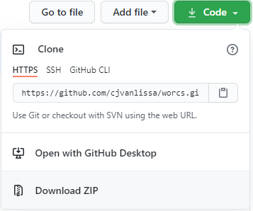

```{r, include = FALSE}
knitr::opts_chunk$set(
  collapse = TRUE,
  comment = "#>"
)
```

This is a tutorial on how to reproduce a project created with the `worcs` package.
At the core of a typical `worcs` projects is an 'R Markdown' document,
containing prose and analysis code.
This document can be compiled, or "knitted", to reproduce the analyses.
This tutorial will guide you through the steps necessary to make that happen.

## Install 'RStudio' and 'R'

**You can skip these steps if you have a recent and working installation of 'RStudio' and 'R'.**

1. Install [R (free)](https://CRAN.R-project.org)
1. Install ['RStudio' Desktop (Free)](https://posit.co/download/rstudio-desktop/)

## Install R-package dependencies

1. Install all packages required for WORCS by running the following code in the 'RStudio' console. Be prepared for three contingencies:  
    + If you receive any error saying *There is no package called [package name]*, then run the code `install.packages("package name")`  
    + If you are prompted to update packages, just press [ENTER] to avoid updating packages. Updating packages this way in an interactive session sometimes leads to errors if the packages are loaded.  
    + If you see a pop-up dialog asking *Do you want to install from sources the package which needs compilation?*, click *No*.

```
install.packages("worcs", dependencies = TRUE)
tinytex::install_tinytex()
renv::consent(provided = TRUE)
```

## Obtaining the project repository

<!-- To do so, open RStudio and, in the console,  -->
<!-- If you are familiar with 'Git' and 'GitHub', you can "clone" the project as usual. -->

WORCS projects are typically hosted on 'GitHub', or another 'Git' remote repository.

The recommended way to obtain a local copy of the project repository is to "clone" it.

On 'GitHub', this is done by clicking the green button labeled "Code". Clicking it reveals the HTTPS link to the project repository (see below).
Copy this link to the clipboard by clicking the clipboard icon next to it.



Next, open an RStudio instance and run the following code in the console, replacing `https://github.com/username/reponame.git` with the HTTPS address you just copied to clipboard, and replacing the `c:/where/you/want/the/repo` with the location on your hard drive where you want to clone the repository:

```
gert::git_clone("https://github.com/username/reponame.git", path = "c:/where/you/want/the/repo")
```


**Note: While it is also possible to download a compressed (ZIP) archive containing the project (see the image above), this has an important limitation: a repository downloaded via the GitHub interface is, itself, not a Git repository! This is a peculiarity of the GitHub interface. This might result in unexpected behavior when using any WORCS functionality that relies on Git for version control. Thus, as a general rule, we advise cloning projects instead.**

## Open the project in 'RStudio'

Most projects can be opened by loading the '.RProj' file in the main folder.
This should be explained in the project 'README.md' as well.

## Restore the package dependencies

You will need to restore the packages used by the authors, using the `renv` package.
See [this article](https://rstudio.github.io/renv/articles/renv.html) for more information about `renv`.

With the project open in 'RStudio', type the following in the console:

```
renv::restore()
```

## Open the project entry point

The entry point is the core document that can be executed to reproduce the analysis.
This is typically a manuscript, or occasionally an R-script file.
Use the following function to open the entry point file in 'RStudio':

```
load_entrypoint()
```

## Reproduce the analyses

From `worcs` version 0.1.12, projects can be reproduced using the function `reproduce()`.
This function will evaluate the reproducibility recipe stored in the `.worcs` project file,
and checks whether the resulting endpoints have the correct checksums (i.e., are unchanged relative to the authors' original work).

## No access to original data

Sometimes, authors have not made the original data available.
In this case, the project ought to contain a synthetic data file with similar properties
to the original data.
This synthetic data allows you to verify that the analyses can be run,
and that the code is correct.
The results will, however, deviate from the original findings and should not be substantively interpreted.

Authors may use the function `notify_synthetic()` to generate a message in the paper when a synthetic dataset is used.
Authors should also provide information in the README.md file on how to obtain access to the original data in case an audit is warranted.
Please read the WORCS paper [@vanlissaWORCSWorkflowOpen2021] for more information about how checksums are used so that auditors can verify the authenticity of the original data.
