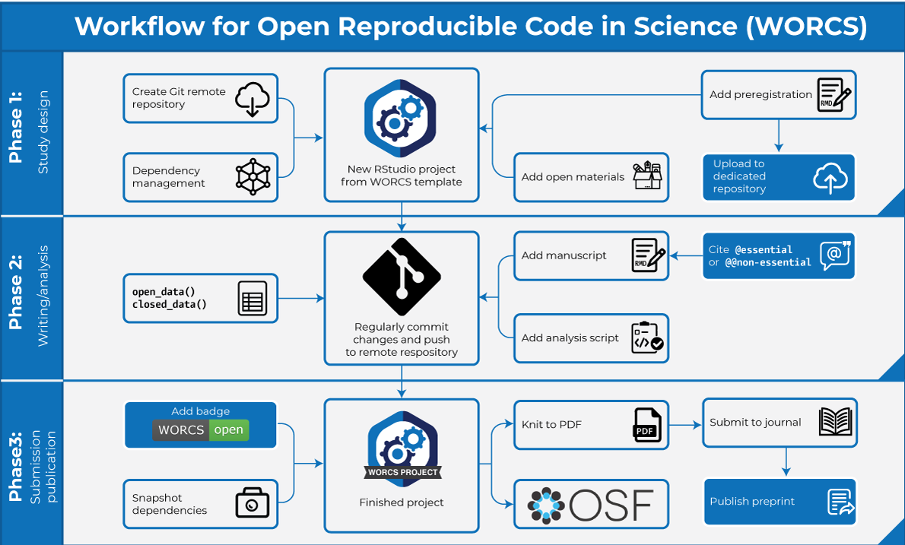

```{r, include = FALSE}
knitr::opts_chunk$set(
  collapse = TRUE,
  comment = "#>"
)
library(worcs)
```

## WORCS: Steps to follow for a project

This vignette describes the Workflow for Open Reproducible Code in Science, as introduced in @vanlissaWORCSWorkflowOpen2021. The paper describes the rationale and principled approach on which the workflow is based; this vignette describes the practical steps for R-users in greater detail.
Note that, although the steps are numbered for reference purposes,
we acknowledge that the process of conducting research is not always linear.
The workflow is illustrated in the graph below, with optional steps displayed in blue nodes:

```{r, echo = FALSE, out.width="100%"}

```

### Phase 1: Study design

1. <!--S: Create a (Public or Private) remote repository on a 'Git' hosting service-->Create a new remote repository on a 'Git' hosting service, such as ["GitHub"](https://github.com)
    + For inexperienced users, we recommend making this repository "Private", which means only you and selected co-authors can access it. You can set it to "Public" later - for example, when the paper goes to print - and the entire history of the Repository will be public record. We recommend making the repository "Public" from the start __only if__ you are an experienced user and know what you are doing.
    + Copy the repository link to clipboard; this link should look something like `https://github.com/username/repository.git`
2. <!--S: When using R, initialize a new RStudio project using the WORCS template. Otherwise, clone the remote repository to your local project folder.-->In Rstudio, click File > New Project > New directory > WORCS Project Template
    a. Paste the remote Repository address in the textbox. This address should look like `https://github.com/username/repository.git`
    b. Keep the checkbox for `renv` checked if you want to use dependency management (recommended)
    c. Select a preregistration template, or add a preregistration later using `add_preregistration()`
    d. Select a manuscript template, or add a manuscript later using `add_manuscript()`
    e. Select a license for your project (we recommend a CC-BY license, which allows free use of the licensed material as long as the creator is credited)
3. <!--S: Add a README.md file, explaining how users should interact with the project, and a LICENSE to explain users' rights and limit your liability. This is automated by the `worcs` package.-->A template README.md file will be automatically generated during project creation. Edit this template to explain how users should interact with the project. Based on your selections in the New Project dialog, a LICENSE will also be added to the project, to explain users' rights and limit your liability. We recommend a CC-BY license, which allows free use of the licensed material as long as the creator is credited.
4. <!--S: Optional: Preregister your analysis by committing a plain-text preregistration and [tag this commit](https://docs.github.com/en/free-pro-team@latest/github/administering-a-repository/managing-releases-in-a-repository) with the label "preregistration".-->Optional: Preregister your analysis by committing a plain-text preregistration and [tag this commit](https://docs.github.com/en/free-pro-team@latest/github/administering-a-repository/managing-releases-in-a-repository) with the label "preregistration":
    + Document study plans in a `preregistration.Rmd` file, and optionally, planned analyses in a `.R` file.
    + In the top-right panel of 'RStudio', select the 'Git' tab
    + Select the checkbox next to the preregistration file(s)
    + Click the Commit button.
    + In the pop-up window, write an informative "Commit message", e.g., "Preregistration"
    + Click the Commit button below the message dialog
    + Click the green arrow labeled "Push" to send your commit to the 'Git' remote repository
    + [Tag this commit as a release](https://docs.github.com/en/free-pro-team@latest/github/administering-a-repository/managing-releases-in-a-repository) on the remote repository, using the label "preregistration". A tagged release helps others retrieve this commit.
    + Instructions for 'GitHub' [are explained here ](https://docs.github.com/en/free-pro-team@latest/github/administering-a-repository/managing-releases-in-a-repository)
<!--        - Go to the 'GitHub' page for your project
        - Click the label that says "0 releases"
        - Click the button labeled "Create new release"
        - In the textbox labeled "Tag version" and the textbox "Release title", write: "Preregistration"
        - Click the green button labeled "Publish release"-->
5. <!--S: Optional: Upload the preregistration to a dedicated preregistration server-->Optional: Render the preregistration to PDF, and upload it as an attachment to a dedicated preregistration server like AsPredicted.org or OSF.io
    + In 'RStudio', with the file 'preregistration.Rmd' open, click the "Knit" button above the top left panel
    + When the PDF is generated, go to one of the recognized preregistration services' websites, create a new preregistration, and upload it as an attachment.
    + Optional: Generate a DOI for the preregistration through [the OSF](https://help.osf.io/article/218-sharing-data) or a service like [Zenodo](https://docs.github.com/repositories/archiving-a-github-repository/referencing-and-citing-content)
6. <!--S: Optional: Add study materials to the repository-->Optional: Add study materials to the repository.
    + Only do this for study materials to which you own the rights, or when the materials' license allows it
    + You can solicit feedback and outside contributions on a 'Git' remote repository by opening an "Issue" or by accepting "Pull requests"

### Phase 2: Writing and analysis

7. <!--S: Create an executable script documenting the code required to load the raw data into a tabular format, and de-identify human subjects if applicable-->Create an executable script documenting the code required to load the raw data into a tabular format, and de-identify human subjects if applicable
    + Document this preprocessing ("data wrangling") procedure in the `prepare_data.R` file.
    + This file is intended to document steps that can not or should not be replicated by end users, unless they have access to the raw data file.
    + These are steps you would run only once, the first time you load data into R.
    + Make this file as short as possible; only include steps that are absolutely necessary
8. <!--S: Save the data into a plain-text tabular format like `.csv`. When using open data, commit this file to 'Git'. When using closed data, commit a checksum of the file, and a synthetic copy of the data.-->Save the data using `open_data()` or `closed_data()`
    + <font colour = "red">__WARNING:__ Once you commit a data file to the 'Git' repository, its record will be retained forever (unless the entire repository is deleted). Assume that pushing data to a 'Git' remote repository cannot be undone. Follow the mantra: "Never commit something you do not intend to share".</font>
    + When using external data sources (e.g., obtained using an API), it is recommended to store a local copy, to make the project portable and to ensure that end users have access to the same version of the data you used.
9. <!--S: Write the manuscript using a dynamic document generation format, with code chunks to perform the analyses.-->Write the manuscript in `Manuscript.Rmd`
    + Use code chunks to perform the analyses. The first code chunk should call `load_data()`
    + Finish each sentence with one carriage return (enter); separate paragraphs with a double carriage return.
10. <!--S: Commit every small change to the 'Git' repository-->Regularly Commit your progress to the Git repository; ideally, after completing each small and clearly defined task.
    + Call `git_update("Describe the changes made since the last commit")` to Add all new files (not blocked by `.gitignore`), Commit them, and Push the changes to a remote repository, all in one step
    + For more control, select the 'Git' tab in the top-right panel of 'RStudio'
    + Select the checkboxes next to all files whose changes you wish to Commit
    + Click the Commit button.
    + In the pop-up window, write an informative "Commit message".
    + Click the Commit button below the message dialog
    + Click the green arrow labeled "Push" to send your commit to the remote repository
11. <!--S: Use comprehensive citation-->While writing, cite essential references with one at-symbol, `[@essentialref2020]`, and non-essential references with a double at-symbol, `[@@nonessential2020]`.

### Phase 3: Submission and publication

12. <!--S: Use dependency management to make the computational environment fully reproducible-->Use dependency management to make the computational environment fully reproducible. When using `renv`, you can save the state of the project library (all packages used) by calling `renv::snapshot()`. This updates the lockfile, `renv.lock`.
13. <!--S: Optional: Add a WORCS-badge to your project's README file-->Optional: Add a WORCS-badge to your project's README file and complete the optional elements of the WORCS checklist to qualify for a "Perfect" rating. Run the `check_worcs()` function to see whether your project adheres to the WORCS checklist (see `worcs::checklist`)
    + This adds a WORCS-badge to your 'README.md' file, with a rank of "Fail", "Limited", or "Open".
    + Reference the WORCS checklist and your paper's score in the paper.
    + *Optional:* Complete the additional optional items in the WORCS checklist by hand, and get a "Perfect" rating.
14. <!--S: Make a Private 'Git' remote repository Public-->Make the 'Git' remote repository "Public" if it was set to "Private"
    + Instructions for 'GitHub': 
        - Go to your project's repository
        - Click the "Settings" button
        - Scroll to the bottom of the page; click "Make public", and follow the on-screen instructions
15. <!--S: [Create a project page on the Open Science Framework (OSF)](https://help.osf.io/article/252-create-a-project) and [connect it to the 'Git' remote repository](https://help.osf.io/article/211-connect-github-to-a-project)-->
[Create a project on the Open Science Framework (OSF)](https://help.osf.io/article/252-create-a-project) and [connect it to the 'Git' remote repository](https://help.osf.io/article/211-connect-github-to-a-project).
    + On the OSF project page, you can select a License for the project. This helps clearly communicate the terms of reusability of your project. Make sure to use the same License you selected during project creation in Step 3.
16. <!--S: [Generate a Digital Object Identifier (DOI) for the OSF project](https://help.osf.io/article/220-create-dois)-->
[Generate a Digital Object Identifier (DOI) for the OSF project](https://help.osf.io/article/220-create-dois)
    + A DOI is a persistent identifier that can be used to link to your project page.
    + You may have already created a project page under Step 5 if you preregistered on the OSF
    + Optionally, you can [generate additional DOIs for specific resources like datasets](https://help.osf.io/article/218-sharing-data).
    + Alternatively, you can [connect your 'Git' remote repository to Zenodo](https://docs.github.com/repositories/archiving-a-github-repository/referencing-and-citing-content), instead of the OSF, to create DOIs for the project and specific resources.
17. <!--S: Add an open science statement to the Abstract or Author notes, which links to the 'OSF' project page and/or the 'Git' remote repository-->Add an open science statement to the Abstract or Author notes, which links to the 'OSF' project page and/or the 'Git' remote repository. 
    + Placing this statement in the Abstract or Author note means that readers can find your project even if the paper is published behind a paywall.
    + The link can be masked for blind review.
    + The open science statement should indicate which resources are available in the online repository; data, code, materials, study design details, a pre-registration, and/or comprehensive citations. For further guidance, see @aalbersbergMakingScienceTransparent2018. Example:  
    _In the spirit of open science, an online repository is available at XXX,
    which contains [the data/a synthetic data file], analysis code, the research
    materials used, details about the study design, more comprehensive citations,
    and a tagged release with the preregistration._
18. <!--S: Render the dynamic document to PDF-->Knit the paper to PDF for submission
    + In 'RStudio', with the file 'manuscript.Rmd' open, click the "Knit" button above the top left panel
    + To retain essential citations only, change the front matter of the 'manuscript.Rmd' file:  
    Change `knit: worcs::cite_all` to `knit: worcs::cite_essential`
19. <!--S: Optional: [Publish the PDF as a preprint, and add it to the OSF project](https://help.osf.io/article/177-upload-a-preprint)-->Optional: [Publish preprint in a not-for-profit preprint repository such as PsyArchiv, and connect it to your existing OSF project](https://help.osf.io/article/177-upload-a-preprint)
    + Check [Sherpa Romeo](http://sherpa.ac.uk/romeo/index.php) to be sure that your intended outlet allows the publication of preprints; many journals do, nowadays - and if they do not, it is worth considering other outlets.
20. <!--S: Submit the paper, and [tag the commit of the submitted paper as a release](https://docs.github.com/en/free-pro-team@latest/github/administering-a-repository/managing-releases-in-a-repository) of the submitted paper as a release, as in Step 4.-->Submit the paper, and [tag the commit of the submitted paper as a release](https://docs.github.com/en/free-pro-team@latest/github/administering-a-repository/managing-releases-in-a-repository), as in Step 4.

### Notes for cautious researchers

<!--S: Some researchers might want to share their work only once the paper is accepted for publication. In this case, we recommend creating a "Private" repository in Step 1, and completing Steps 13-18 upon acceptance.-->Some researchers might want to share their work only once the paper is accepted for publication. In this case, we recommend creating a "Private" repository in Step 1, and completing Steps 13-18 upon acceptance by the journal.

**Image attribution**

The [Git Logo](https://git-scm.com/) by Jason Long is licensed under the Creative Commons Attribution 3.0 Unported License. The [OSF logo](https://osf.io/) is licensed under CC0 1.0 Universal. Icons in the workflow graph are obtained from Flaticon; see [detailed attribution](https://github.com/cjvanlissa/worcs/blob/master/paper/workflow_graph/Attribution_for_images.txt).

## Sample WORCS projects

For a list of sample `worcs` projects created by the authors and other users, see the [`README.md` file on the WORCS GitHub page](https://github.com/cjvanlissa/worcs). This list is regularly updated.

**References**
